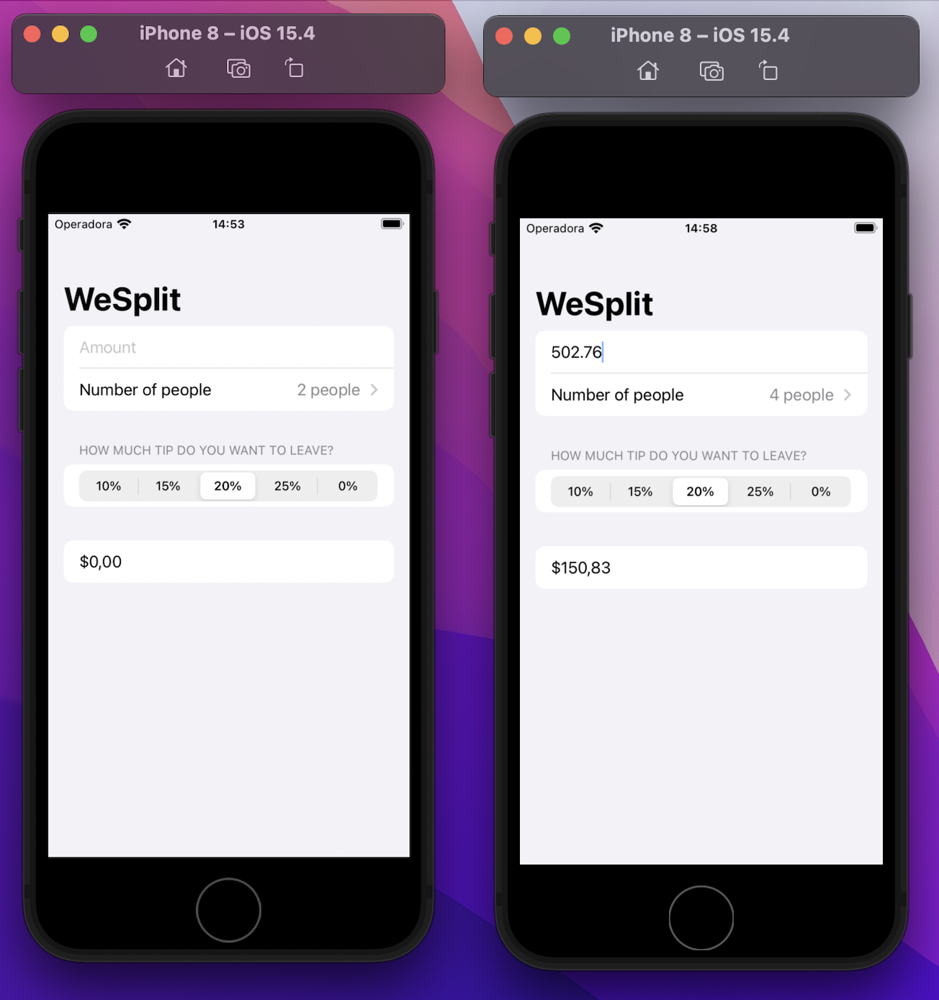

# WeSplit

A project to help a group of people to share the bill. 

The user need to enter the amount, number of people, and the amount of the tip.

The application will show the amount that each person will pay.

## Project

This project was developed using SwiftUI.

To start, I used a struct with all the rules to calculate the final result.

So in the View I used Navigation View with Form. 

Inside Form, I added a section that contains text field and picker to the user select number of people. In the second section there are a header: Text and a picker to select the amount of the tip, I used 20% default, but the user can change it. The last section there is text that show the amount that each person will pay.

At the top of the screen there is a navigationBarTitle.

**Learning about: SwiftUI, Xcode, View, NavigationView, Form, Section, TextField, Picker, ForEach, and more.**

*This project was developed during Hacking with SwiftUI course.*
